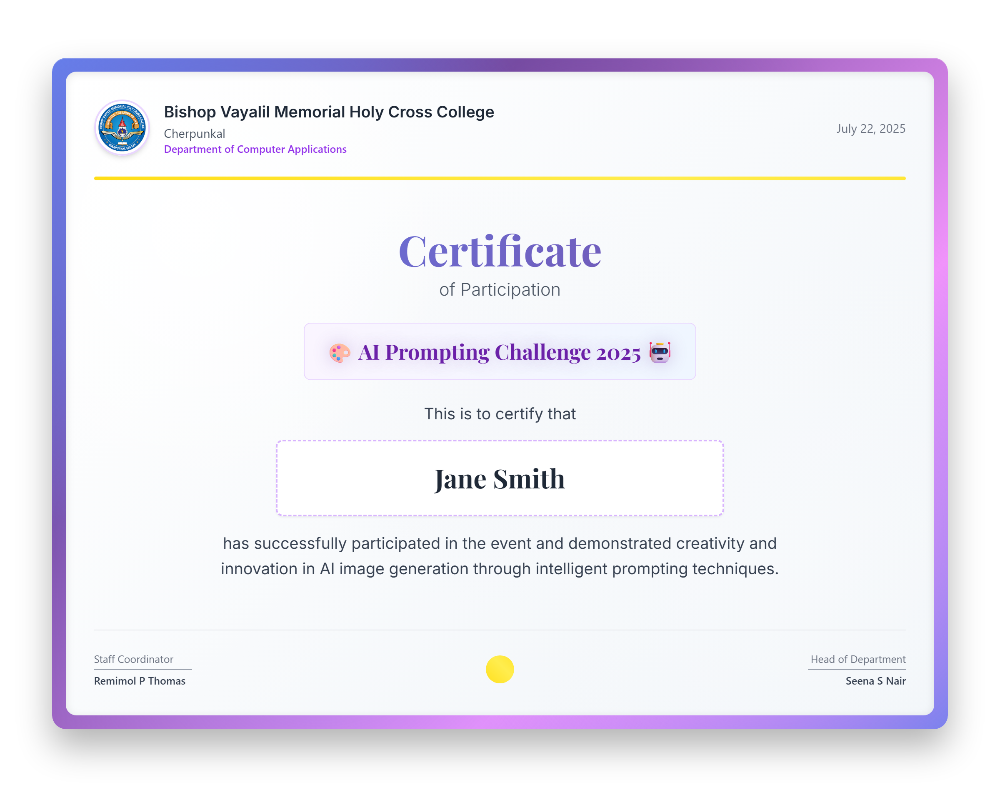

# Certificate Generator for AI Prompting Challenge 2025



## Overview

This project generates beautiful, high-resolution participation certificates for the **AI Prompting Challenge 2025** held at Bishop Vayalil Memorial Holy Cross College, Cherpunkal. Certificates are created using a modern HTML+Tailwind CSS template and rendered to PNG images via Python and Playwright.

## Features

- Reads participant data from a CSV file
- Uses a visually stunning, branded certificate template
- Renders certificates as high-quality PNG images
- CLI progress bar for batch generation
- Customizable design (edit `template.html`)

## Folder Structure

```
CertificateGenerator/
├── certificates/         # Output PNG certificates
├── data/
│   └── names.csv         # Participant data (name, no)
├── images/
│   ├── college_logo.png  # College logo
│   └── backdrop.png      # Optional background
├── template.html         # Certificate HTML template
├── generate_certificates.py # Main Python script
├── requirements.txt      # Python dependencies
└── README.md             # Project documentation
```

## Quick Start

### 1. Install Dependencies

```powershell
pip install -r requirements.txt
python -m playwright install
```

### 2. Prepare Participant Data

Edit `data/names.csv`:

```
name,no
John Doe,1001
Jane Smith,1002
```

### 3. Customize Certificate Design

- Edit `template.html` for colors, layout, and branding.
- Place your logo in `images/college_logo.png`.

### 4. Generate Certificates

```powershell
python generate_certificates.py
```

Certificates will be saved in the `certificates/` folder as `<name>_<no>.png`.

## How It Works

- The script reads each participant from `names.csv`.
- It fills the name into the HTML template.
- Playwright launches a browser, zooms in for a filled look, and takes a high-res screenshot.
- Progress is shown in the terminal.

## Customization

- **Design:** Edit `template.html` (uses Tailwind CSS, Google Fonts, gradients, and glassmorphism).
- **Resolution:** Adjust viewport and zoom in `generate_certificates.py`.
- **Branding:** Update logo and colors as needed.

## Purpose

- Developed for the AI Prompting Challenge 2025
- Powered by Python, Playwright, Tailwind CSS

---
